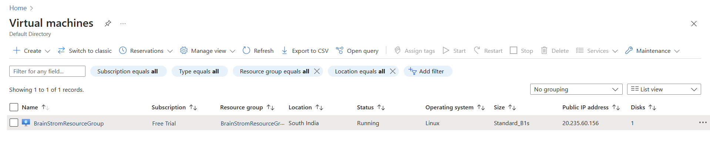
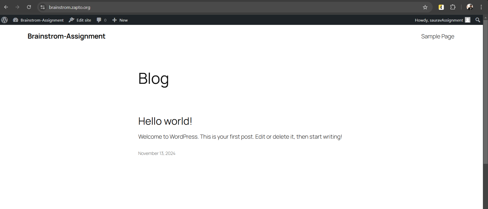
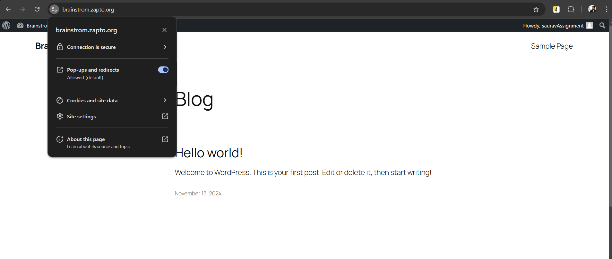

# Brainstrom-Assignment

We will be optimizing WordPress site on an Azure VPS with Nginx, MySQL/MariaDB, and PHP on Ubuntu 22.04, along with SSL/TLS and hosting the site on No-IP. We need follow below step

**1.Provision the VPS on Azure**

- Log in to your Azure account.
- Navigate to Virtual Machines -> Create -> Azure Virtual Machine.
- Choose Ubuntu 22.04 as the OS, choose VM size as Standard B1s, and configure SSH key authentication.
- Now we will configure network settings:
    - Now we will open ports 80 (HTTP), 443 (HTTPS), and 22 (SSH).
- Click on Review and create. Once done, we can see the virual machince created as below

    

**2. Now we will configure the VPS for Security**

- Login into the server using the connect option
- Update package
```bash
sudo apt update
sudo apt upgrade -y
```
- Install essential packages
```bash
sudo apt install ufw fail2ban -y
```
- Configure UFW for firewall
```bash
sudo ufw allow 'OpenSSH'
sudo ufw allow 'Nginx Full'
sudo ufw enable
```
- To prevent brut-force attack, we can implement Fail2Ban
```bash
sudo systemctl enable fail2ban --now
```
**3. Install Nginx, MySQL/MariaDB, and PHP**

- To install Nginx:
```bash
sudo apt install nginx -y
```

- To install MySQL or MariaDB:
```bash
sudo apt install mariadb-server mariadb-client -y
```
- Secure the MySQL installation:
```bash
sudo mysql_secure_installation
```
- To install PHP and required modules:
```bash
sudo apt install php-fpm php-mysql php-curl php-xml php-zip php-gd php-mbstring -y
```
**4. Configure MySQL Database for WordPress**
- Log in to MySQL:
```bash
sudo mysql -u root -p
```
- We will create a new database and user for WordPress
```bash
CREATE DATABASE wordpress_db DEFAULT CHARACTER SET utf8mb4 COLLATE utf8mb4_unicode_ci;
CREATE USER 'wordpress_user'@'localhost' IDENTIFIED BY 'your_password';
GRANT ALL PRIVILEGES ON wordpress_db.* TO 'wordpress_user'@'localhost';
FLUSH PRIVILEGES;
EXIT;
```

**5. Install and Configure WordPress**

- Now we will download wordpress
```bash
cd /tmp
wget https://wordpress.org/latest.tar.gz
tar -xzvf latest.tar.gz
```

- Copy files to the web directory:
```bash
sudo cp -a /tmp/wordpress/. /var/www/html
```
- Now we will give permission to both the files
```bash
sudo chown -R www-data:www-data /var/www/html
sudo find /var/www/html -type d -exec chmod 755 {} \;
sudo find /var/www/html -type f -exec chmod 644 {} \;
```
- Now we will create a WordPress configuration file:
```bash
cd /var/www/html
sudo cp wp-config-sample.php wp-config.php
```
- Now we need to edit wp-config.php to add the database details:
```bash
sudo nano wp-config.php
```
- After this we will update the following lines with the database name, username, and password:
```bash
define('DB_NAME', 'wordpress_db');
define('DB_USER', 'wordpress_user');
define('DB_PASSWORD', 'your_password');
```

**6. Optimize Nginx Configuration**

 - Create a new Nginx configuration file for WordPress:
 ```bash
 sudo nano /etc/nginx/sites-available/wordpress
```

- Add the following configuration:
```bash
server {
    listen 80;
    server_name noip_hostname;

    root /var/www/html;
    index index.php index.html index.htm;

    location / {
        try_files $uri $uri/ /index.php?$args;
    }

    location ~ \.php$ {
        include snippets/fastcgi-php.conf;
        fastcgi_pass unix:/var/run/php/php8.1-fpm.sock;
    }

    location ~* \.(jpg|jpeg|png|gif|ico|css|js)$ {
        expires 365d;
    }

    gzip on;
    gzip_types text/css application/javascript image/jpeg image/png;
}
```
- Enable the configuration
```bash
sudo ln -s /etc/nginx/sites-available/wordpress /etc/nginx/sites-enabled/
sudo nginx -t
sudo systemctl restart nginx
```
After this step, we can see the wordpress site being loaded in the hostname we created



**7. Now we will install SSL Certificate**
- Install Certbot:
```bash
sudo apt install certbot python3-certbot-nginx -y
```
- Now we will obtain and configure an SSL certificate:
```bash
sudo certbot --nginx -d noip_hostname
```

After this we can see the SSL is added in our hostname



**8. Now we will configure NO-IP in the server to automatically update the IP changes**

- Register for an account at No-IP.
- Create a hostname and link it to the Azure VM’s public IP.
- Now we will configure No-IP DUC on the server to update IP changes:
```bash
cd /usr/local/src/
sudo wget http://www.no-ip.com/client/linux/noip-duc-linux.tar.gz
sudo tar xf noip-duc-linux.tar.gz
cd noip-*
sudo make
sudo make install
```

**Now we will enable caching**

- To enable micro caching, we can enable it using below command
```bash
proxy_cache_path /var/cache/nginx levels=1:2 keys_zone=microcache:10m max_size=100m;
proxy_cache_key "$scheme$request_method$host$request_uri";

location / {
    proxy_cache microcache;
    proxy_cache_valid 200 1s;
    proxy_cache_valid any 1s;
    add_header X-Proxy-Cache $upstream_cache_status;
}
```
**Gzip compression**

To enable gzip compression, we can it it up as below
```bash
gzip on;
gzip_types text/plain text/css application/json application/javascript text/xml application/xml application/xml+rss text/javascript;
gzip_min_length 256;
gzip_vary on;
gzip_proxied any;
gzip_comp_level 5;
```


